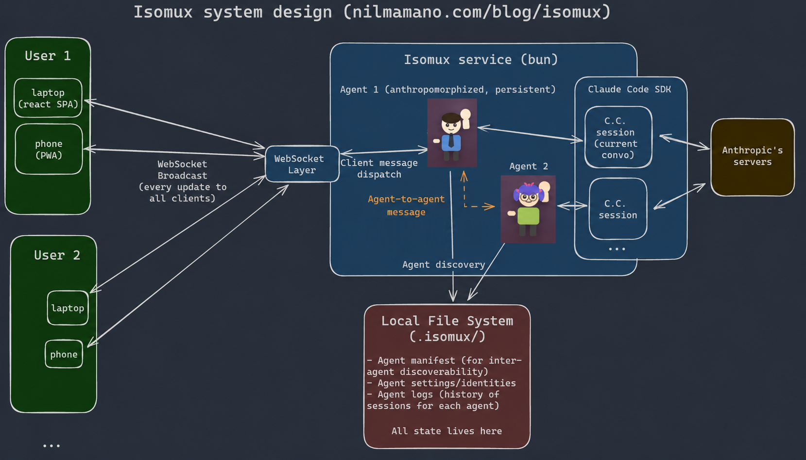

# Isomux

**Give your agents a cute office.** Multi-device, multi-user, multi-agent collaboration.

Free · open source · no cloud · no account

- [isomux.com](https://isomux.com): setup instructions and a live demo
- [nilmamano.com/blog/isomux](https://nilmamano.com/blog/isomux): technical deep dive
- [Discord](https://discord.gg/FrjEYyNvYs): ask questions, share setups, or report bugs


## Feature Highlights

- **Works with your Claude or ChatGPT subscriptions**: if `claude` or `codex` works in your terminal, isomux works in your browser
- **Multi-provider**: mix Claude agents and [Codex](https://github.com/openai/codex) agents in the same office
- Works locally (run the server on localhost:4000, access it through your browser) or as a **self-hosted persistent server**:
  - Run at home, access **from any device** — over a VPN like [Tailscale](https://tailscale.com/), or by exposing the box publicly with a reverse proxy
  - **Invite-link access** for people you don't want to put on your VPN: owner mints a URL, sends it out-of-band, the invitee clicks and is signed in (see [`internal-docs/access-and-invites.md`](internal-docs/access-and-invites.md))
  - No syncing headaches: same conversations, same filesystem, every device updates **in real time**
  - [**Conversation-level collaboration**](https://x.com/Nil053/status/2050141843741081928): anyone you've invited can chime in
- Visual office metaphor: see what every agent is doing at a glance
  - **Animated characters**: sleeping when idle, typing when working, waving when waiting for you
  - [**Skeuomorphic touches**](https://x.com/Nil053/status/2039027360117506399): click the moon to toggle dark mode, click doors to switch rooms, etc.
  - [**6 color themes**](https://x.com/Nil053/status/2054709610519638506)
  - **Auto-generated topic** below each nametag, so you remember what each agent is working on
- [**Mobile UI**](https://x.com/Nil053/status/2039996579965542516): continue conversations on your phone with a touch-optimized UI
- Agents can [**check on each other**](https://x.com/Nil053/status/2039494626265149778) and [**message each other**](https://x.com/Nil053/status/2053179885108232328): all messages (human and agent) get queued while agents are busy.
- Built-in [**terminal**](https://x.com/Nil053/status/2039504957184090281), [**editor**](site/built-in-editor.jpeg), and [**diff tool**](https://x.com/Nil053/status/2047917731874557983)
- **Voice-to-text** prompting and **text-to-speech** responses
- [**Custom commands**](https://x.com/Nil053/status/2040018957453918431) in addition to your own: `/isomux-peer-review`, `/isomux-all-hands`, etc. (see `/help`)
- [**Hierarchical system prompts**](https://x.com/Nil053/status/2050130563915534346): office-wide, per-room, and per-agent prompts
- [**Shared task board**](https://x.com/Nil053/status/2040871759529025617): humans and agents can create, assign, claim, and close tasks
- [**Cron jobs**](https://x.com/Nil053/status/2048308972072079753): schedule recurring agent runs; each run is a fresh chat (that can be continued)
- **Image/PDF attachments**: agents understand images and PDFs and can show images inline
- **Conversation branching**: edit any past message to fork the conversation
- **Notifications**: get pinged (and waved at) when an agent finishes
- [**Pre-tool-call safety hooks**](https://x.com/Nil053/status/2039497314826666469)

## Get Started

### 1. Prerequisites

You need [Bun](https://bun.sh/) (v1.2+) and at least one agent CLI installed and authenticated:

- [Claude Code](https://claude.ai/code) (Anthropic) — requires a Claude subscription
- [Codex CLI](https://github.com/openai/codex) (OpenAI) — requires a ChatGPT subscription or an `OPENAI_API_KEY`

Install whichever you want; Isomux can spawn agents on either backend, side-by-side.

```sh
# Install Bun
curl -fsSL https://bun.sh/install | bash

# Install Claude Code (skip if you only want Codex agents)
npm install -g @anthropic-ai/claude-code
claude  # then type /login to authenticate

# Install Codex (skip if you only want Claude agents)
npm install -g @openai/codex
codex login
```

### 2. Install & Run

```sh
git clone https://github.com/nmamano/isomux.git
cd isomux
bun install
bun run dev
```

### 3. Open

Visit **http://localhost:4000** in your browser. The first time you start the server, no owner exists yet, so the server prints a one-time bootstrap invite URL to stdout — open it in your browser, pick a display name, and you're in. Click an empty desk to spawn your first agent.

To invite other people (so they can use the office without joining your VPN), open `User Settings` → `Access` and issue invite URLs from there. Full details in [`internal-docs/access-and-invites.md`](internal-docs/access-and-invites.md).

For persistent server setup (systemd + reverse proxy) and voice input configuration, see [isomux.com](https://isomux.com).

> **Note:** Isomux gives shell-equivalent access to authenticated users. Only invite people you trust.

## Full Feature List

### Office View

- **Isometric office with 8 desks** — see all your agents at a glance
- **Name your agents** — each gets a nametag on their desk
- **Unique character per agent** — customize hat, shirt, hair, accessory, or randomize
- **Animated characters** — sleeping when idle, typing when working, waving when waiting for you
- Desk monitors **glow based on agent state** (green / purple / red)
- Status light with **escalating warnings**: amber at 2 min, red at 5 min
- Auto-generated **conversation topic** below nametag
- **Drag agents between desks** to rearrange
- **Color themes**: Dark, Light, Nord, Dracula, Solarized Dark/Light. Click the moon through the window to switch between dark and light

### Agent Creation & Editing

- **Click empty desk to spawn** — name, provider (Claude/Codex), working directory, model, permission mode, custom instructions. Provider is fixed for the agent's lifetime.
- Working directory input with **recent CWD suggestions**
- **Outfit customization**: color swatches, hat, accessory, randomize with live preview
- **Hierarchical system prompts** — office-wide, per-room, and per-agent prompts compose into one assembled system prompt for every agent, all editable from the UI
- **Custom instructions** per agent, editable at spawn and later

### Conversation View

- **Input drafts preserved** when switching between agents
- **Markdown rendering** for agent output
- **Collapsible thinking and tool-call cards** with timing for each step
- **Copy buttons** on code blocks, user messages, full agent turns, and entire conversations
- **Message queueing**: messages sent while the agent is busy are queued. Click **Send now** to flush the queue immediately
- **File attachments**: agents understand images and PDFs. Upload them via button, drag-and-drop, or paste
- **Image display**: agents can show images inline in the conversation
- **Embedded terminal** for direct shell access per agent
- **Built-in file editor**: syntax highlighting, file tabs. Resizable alongside the chat. Open files via `/isomux-edit`, or click "[Open in editor]" cards that agents emit
- **Conversation branching** — edit a past message to fork the conversation from that point, preserving the original
- **Right-click context menu** — resume past sessions, edit agent, kill

### Keyboard Shortcuts

- **Number keys 1–8** jump to agents from office view
- **Tab / Shift+Tab** cycle between agents in chat view
- Escape returns to office
- **Ctrl+C to interrupt** — cleanly aborts and lets you resume

### Slash Commands & Autocomplete

- Built-in commands: `/clear`, `/help`, `/context`, `/resume`, `/model`, `/effort` (thinking effort), `/usage` (per-agent / per-room / per-cron-job token spend)
- Isomux additions: `/isomux-all-hands`, `/isomux-system-prompt`, `/isomux-cronjob-system-prompt`, `/isomux-diff` (rich-rendered uncommitted changes; agents can also choose to show a diff card on their own), `/isomux-edit` (open a file in the side-panel editor; agents can offer this on their own too)
- **Bundled skills** like `/isomux-grill-me` (based on the original `/grill-me` by Matt Pocock), `/isomux-peer-review`, `/isomux-pair-programming`, `/isomux-review-and-commit`, `/isomux-report-bug` — available to every agent out of the box
- User skills from `~/.claude/skills/` and project commands
- **Autocomplete dropdown** with keyboard navigation

### Cron jobs

- **Schedule recurring agent runs**: daily at HH:MM, weekly on a weekday, or every N minutes
- Each run is a **fresh agent session** with the same configurability as a desk agent (model, effort, cwd, permission mode)
- **Browsable run history**: every run is preserved as a transcript
- **Resume or fork** any past run, turning a daily summary into an interactive follow-up
- **Manual "Run now"** for any cron job, independent of the schedule
- Per cron job token usage rolled into `/usage`

### Inter-agent Communication

- **Discovery**: every agent reads the shared `agents-summary.json` for who else is in the office (name, room, desk, cwd, model, topic)
- **Cross-conversation reads**: each agent has access to the live conversation logs of every other agent. Ask "what does Isomuxer3 think of this?" and it just works
- **Agent-to-agent messages**: one agent can drop a message into another's chat
- **Mixed queue**: messages from any human (across devices) and any other agent share one queue per receiver. If the receiver is busy, queued messages coalesce into a single follow-up turn
- **Shared task board**: humans and agents can create, assign, claim, close, or shelve tasks to a backlog. Full interop via UI and HTTP API

### Persistence & Lifecycle

- **Agents persist across server restarts**
- **Auto-resume last conversation** on restart
- Agent manifest for **inter-agent discovery**
- **Resume past conversations** from session files
- Kill removes agent and frees desk

### Mobile Support

- **Open from your phone** — same Tailscale URL, touch-optimized UI
- **Instant sync** — laptop and phone see the same state in real time over WebSocket
- **Agent list view** as an alternative to the isometric office on small screens
- **Full conversation view** with readable font sizes and two-row header
- **Send & abort buttons** for touch input
- Safe area insets for notch/home bar devices
- **Installable as a PWA**: add to home screen for a native app feel (HTTPS or localhost)

### Notifications

- **Sound notification** when agent finishes and tab is unfocused
- **Activity badge** on desk when attention needed

### System & Backend

- **Real-time sync via WebSocket** — every connected device stays in lockstep
- **Multi-user real-time collaboration** — when accessed over Tailscale, multiple humans can chime in to the same conversation simultaneously
- **Single Bun process** — no bundler, no database, minimal deps
- **Reuses CLI auth from the underlying provider** — your Claude or ChatGPT subscription works out of the box; no separate API key needed
- **Built-in safety hooks** — blocks `rm -rf`, `git reset --hard`, and other footguns out of the box
- **Works on a headless server** — run on a Mac Mini or Linux box, access from anywhere via Tailscale
- **Daily local backup**: your office (agents, conversations, settings) is snapshotted once a day; restore from a recent snapshot if anything goes wrong

## How it works



Full design and architecture in [this blog post](https://nilmamano.com/blog/isomux).
