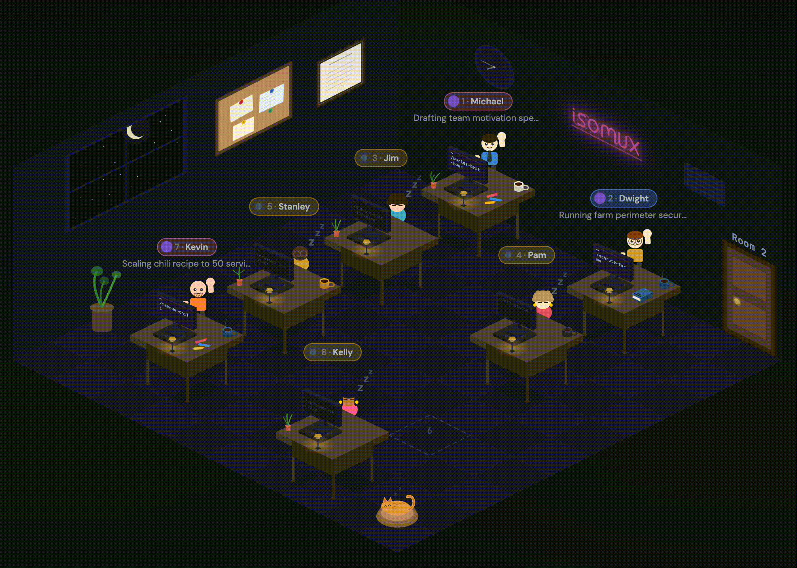

# Isomux

**Give your agents a cute office.** Multi-device, multi-user, multi-agent collaboration.

free · open source · no account needed

- [isomux.com](https://isomux.com): setup instructions and a live demo
- [isomux.com/docs](https://isomux.com/docs): full feature list, self-hosted setup, security audit, more
- [nilmamano.com/blog/isomux](https://nilmamano.com/blog/isomux): technical deep dive
- [Discord](https://discord.gg/FrjEYyNvYs): ask questions, share setups, or report bugs



## Feature Highlights

### Multi-provider

- Mix Claude agents and Codex agents in the same office
- **Works with your subscriptions**: if `claude` or `codex` works in your terminal, isomux works in your browser

### Multi-agent

- Agents [**check on each other**](https://x.com/Nil053/status/2039494626265149778) and [**message each other**](https://x.com/Nil053/status/2053179885108232328): all messages (human and agent) get queued while agents are busy
- [**Shared task board**](https://x.com/Nil053/status/2040871759529025617): humans and agents can create, assign, claim, and close tasks
- [**Hierarchical system prompts**](https://x.com/Nil053/status/2050130563915534346): office-wide, per-room, and per-agent prompts
- [**Custom commands**](https://x.com/Nil053/status/2057153876332331507) in addition to your own: `/pair-programming`, `/peer-review`, etc.

### Multi-user

- [**Collaborate in agent conversations**](https://x.com/Nil053/status/2050141843741081928): anyone you've invited to your office can chime in
- [**Live user presence**](https://x.com/Nil053/status/2056256446862704838): other users (and your other devices) appear as small ghosts next to the agent they're talking to
- [**Invite-link access**](https://isomux.com/docs/access-and-invites): owner mints a URL per device, sends it out-of-band, the invitee clicks and is signed in. No accounts, no passwords

### Multi-device

- Run on `localhost:4000` for local use, or as a **self-hosted persistent server** reachable **from any device** (see [how](https://isomux.com/docs/self-hosted))
- [**Mobile UI**](https://x.com/Nil053/status/2039996579965542516): continue on your phone with a touch-optimized UI
- **Real-time updates**: same conversations, same filesystem, no syncing headaches between devices

### Cute in a useful way

- Visual office: see what every agent is doing at a glance
- **Animated characters**: sleeping when idle, typing when working, waving when waiting for you
- [**Skeuomorphic touches**](https://x.com/Nil053/status/2039027360117506399): click the moon to toggle dark mode, click doors to switch rooms, etc.
- [**6 color themes**](https://x.com/Nil053/status/2054709610519638506)
- **Auto-generated topic** below each nametag, so you remember what each agent is working on

### QoL

- Built-in [**terminal**](https://x.com/Nil053/status/2039504957184090281), [**editor**](site/built-in-editor.jpeg), and [**diff tool**](https://x.com/Nil053/status/2047917731874557983)
- **Voice-to-text** prompting and **text-to-speech** responses
- [**Cron jobs**](https://x.com/Nil053/status/2048308972072079753): schedule recurring agent runs; each run is a fresh chat (that can be resumed)
- **Image/PDF attachments**: agents understand images and PDFs and can show images inline
- **Conversation branching**: edit any past message to fork the conversation
- **Notifications**: get pinged (and waved at) when an agent finishes
- [**Pre-tool-call safety hooks**](https://x.com/Nil053/status/2039497314826666469)

See the [full feature list](docs/features.md).

## Get Started

### 1. Prerequisites

You need [Bun](https://bun.sh/) (v1.2+) and at least one agent CLI installed and authenticated:

- [Claude Code](https://claude.ai/code) (Anthropic) — requires a Claude subscription
- [Codex CLI](https://github.com/openai/codex) (OpenAI) — requires a ChatGPT subscription or an `OPENAI_API_KEY`

Install whichever you want; Isomux can spawn agents on either backend, side-by-side.

```sh
# Install Bun
curl -fsSL https://bun.sh/install | bash

# After `bun.sh/install` finishes, open a new shell (or source your shell
# rc) so the next commands can find `bun` on PATH.

# Install Claude Code (skip if you only want Codex agents)
npm install -g @anthropic-ai/claude-code
claude  # then type /login to authenticate
```

Codex ships bundled with isomux — no separate install. The first time you message a Codex agent, isomux prompts you to sign in via a one-click terminal card.

### 2. Install & Run

```sh
git clone https://github.com/nmamano/isomux.git
cd isomux
bun install
bun run dev
```

### 3. Open

Visit **http://localhost:4000** in your browser. The first time you start the server, no owner exists yet, so the page asks you to pick a display name to claim ownership. Submit and you're in.

Want to run it on an always-on box, access from every device, and invite other users to your office? See [self-hosted setup](docs/self-hosted.md).

> **Note:** Isomux agents can run shell commands, so authenticated users effectively have shell access to the host. Only invite people you trust.

## How it works

Curious about the internals? [Read how it works](docs/how-it-works.md).
