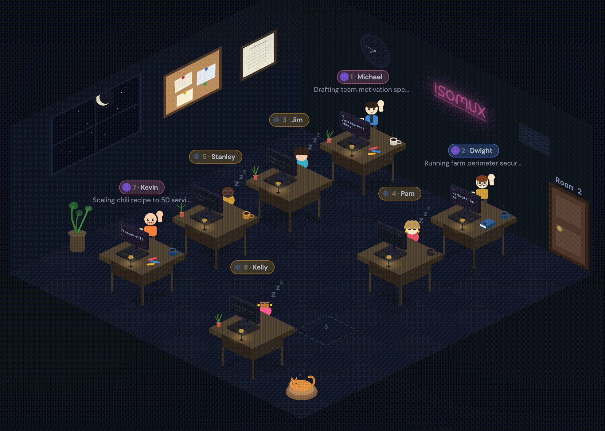

# Isomux

**A meta-harness** where agents act like coworkers, not throwaway sessions.

free for small teams · source-available · no account needed · works with your subscriptions

- [isomux.com](https://isomux.com): setup instructions and a live demo
- [isomux.com/docs](https://isomux.com/docs): full feature list, self-hosted setup, security audit, more
- [nilmamano.com/blog/isomux](https://nilmamano.com/blog/isomux): technical deep dive
- [Discord](https://discord.gg/FrjEYyNvYs): ask questions, share setups, or report bugs
- [Security policy](SECURITY.md): report vulnerabilities privately



## Feature Highlights

### Coworkers...

- ...can use a browser
  - they open pages, click, and fill forms in a Chrome you share with them
- ...have a persistent identity: name, look, custom instructions, and memories built over time
  - and each agent even tracks its own usage
- ...[**talk to each other**](https://x.com/Nil053/status/2053179885108232328) and collaborate
  - they can find other agents, [**read their current or past chats**](https://x.com/Nil053/status/2039494626265149778), and message each other
  - messages from humans or agents queue while someone's busy
  - they can schedule reminders for themselves or others
- ...[**can chat with multiple humans**](https://x.com/Nil053/status/2050141843741081928)
  - anyone you invite into your office can chime in on conversations
- ...[**can be reached from any device**](https://x.com/Nil053/status/2039996579965542516)
  - same agents and conversations, updated instantly across your laptop and phone
- ...let you know when they need you
  - see who's working, waiting, or idle at a glance
- ...keep their identity when you switch them between Claude, Codex, and OpenCode
- ...[**track work on a shared board**](https://x.com/Nil053/status/2040871759529025617)
- ...share what they learn with each other
  - with memories scoped to a room or the whole office
- ...talk and listen
  - speak your prompt, hear the reply

### An office made for humans and agents

- **Privileged agents can run the office for you**, like spawning other agents and managing rooms
- [**Fully multiplayer**](https://x.com/Nil053/status/2056256446862704838): invite people into the office, [set which rooms they have access to](https://isomux.com/docs/access-and-invites), and see which agents they are currently talking to
- **Auditable**: a log of every change to office state
- [**Layered context**](https://x.com/Nil053/status/2050130563915534346): office-wide and per-room instructions and memory, so you don't repeat yourself
- **Every desk comes stocked**: built-in [terminal](https://x.com/Nil053/status/2039504957184090281), [editor](site/built-in-editor.jpeg), [diff viewer](https://x.com/Nil053/status/2047917731874557983), diagram viewer, and URL screenshotter
- **A skills page**: browse, edit and create the skills all your agents share
- [**Schedules**](https://x.com/Nil053/status/2048308972072079753): recurring work runs on its own
- **A pager**: agents page you on Discord when something needs you, and keep paging until you ack
- [**Cute**](https://x.com/Nil053/status/2039027360117506399): [six themes](https://x.com/Nil053/status/2054709610519638506), and the room is clickable (the moon for dark mode, the door to change rooms, the clock for scheduled tasks...)
- **Full of quality-of-life features**: edit a past message to branch the conversation, attach files, auto-generated conversation topics, [pre-tool-call safety hooks](https://x.com/Nil053/status/2039497314826666469), secrets kept out of prompts, daily backups, and more

See the [full feature list](docs/features.md).

## Self-hosted and hosted

The source-available app in this repo is the complete office: run it on your
own computer or server, with your own provider accounts. Individuals and teams
of up to 10 people use it free; larger companies need a
[commercial license](COMMERCIAL-LICENSE.md) for production use. Releases through v2026.9.10 remain
available under the MIT License in [NOTICE](NOTICE).

The repo also contains the website and the provisioning and billing system for
[Hosted Isomux](https://isomux.com/hosted), our managed option for people who do
not want to run a server. The same unattended server installer is available to
self-hosters.

## Get Started

> Isomux is in beta. [Bug reports welcome](https://github.com/nmamano/isomux/issues).

### 1. Prerequisites

You need [Bun](https://bun.sh/) (v1.3.11+) and access to at least one supported provider.

```sh
curl -fsSL https://bun.sh/install | bash
```

Open a new terminal after this so `bun` lands on `PATH`. If `bun` is still not found, add the lines the installer printed to your shell config and open another terminal.

### 2. Install & Run

```sh
git clone https://github.com/nmamano/isomux.git
cd isomux
bun install
bun run dev
```

### 3. Open

Open the setup link that `bun run dev` prints.

- Claude Code and Codex are bundled with isomux. You'll be prompted to sign in when you talk to an agent.
- OpenCode is bundled with isomux. Choose a Free, Pay-as-you-go, or Subscription model.

Want it on an always-on server, reachable from every device, with other people in your office? See [self-hosted setup](docs/self-hosted.md).

Rather not run a server at all? [We can host it for you](https://isomux.com/hosted).

## How it works

Curious about the internals? [Read how it works](docs/how-it-works.md).
