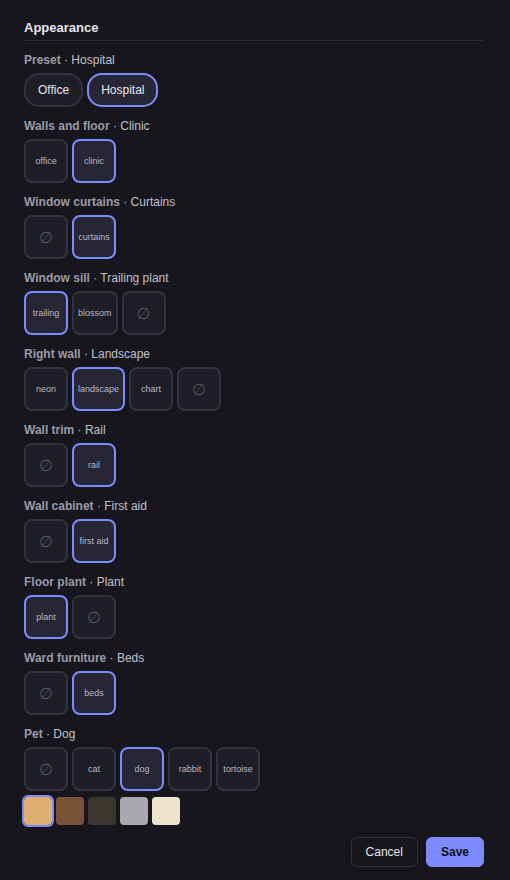

# Room customization (task 75598fe2)

Status: approved by Nil and built, 2026-10-02 (batch 1004, lane 5).

## What the member gets

The Appearance section of the room settings pane grows into a room
customization section, laid out like the Appearance section of the agent
settings dialog: one row per choice, each row a label, the current value, and a
row of option tiles. Each tile shows its option drawn small from the scene's own
SVG, like the outfit tiles, cropped to where the option sits in the room; a
"None" tile shows that spot bare. The preset tiles draw the whole room. Words
appear only as the row label and as each tile's accessible name (Nil,
2026-10-02). The preset row sits on top,
where the agent section has its Randomize button. Today that section holds one
control, the "Room look" select. The pet stays clickable in the scene as a
shortcut; the section is the place where every choice lives, including the ones
with nothing to click. The pane already scrolls; Save stays reachable on mobile.

The lobby has its own scene and gets no section, as today.

(Design mockup: static HTML; words stand in for the tile drawings. The built
section draws every tile.)

## The choices

Furniture with a function stays fixed in every room: the window (theme toggle), the
corkboard (tasks), the wall screen (apps), the clock (schedules), the vent
(settings), the doors and the desks. Seasonal decorations stay automatic.

| Choice | Slot and wire values | Office preset | Hospital preset |
| --- | --- | --- | --- |
| Scene palette | `walls`: `office`, `clinic` | office | clinic |
| Window curtains | `curtains`: `none`, `tied` | none | tied |
| Window sill | `sill`: `trailing`, `blossom`, `none` | rotates by room | rotates by room |
| Right wall | `wallArt`: `neon`, `landscape`, `chart`, `none` | neon | rotates landscape / chart |
| Wall trim | `trim`: `none`, `rail` | none | rail |
| Wall cabinet | `cabinet`: `none`, `first-aid` | none | first-aid |
| Floor plant | `floorPlant`: `plant`, `none` | plant | plant |
| Ward furniture | `ward`: `none`, `beds` | none | beds |
| Pet shown | `pet`: `shown`, `none` | shown | none |

`walls` selects the scene palette, not only the wall and floor colours. `office`
is the theme's own palette. `clinic` is the hospital's: a green-white palette
in light mode and a Dracula-derived one in dark mode, which also recolours the
wall plates and the clock hands.

`beds` is the set the hospital draws today: two beds, the IV stand, the bedside
cabinet and the cubicle curtain. It is one choice because layout.test.ts holds
the beds clear of the desks as a set.

The "rotates" defaults keep today's alternation by room index.

The neon sign is a wall decoration like the others (Isomux PM ruling,
2026-10-02): when a room shows another right-wall option, the landing link is
not there, as in hospital rooms today.

## Presets

A preset is the base the choices sit on. A room stores its preset (the existing
`skin` field: `office` or `hospital`) and only the slots a member changed.
What the room draws is the preset's value for every slot, replaced by each
stored change. A room with skin `hospital` and no changes draws exactly what it
draws today, so no stored room needs a migration.

## The menu: staging and Save

Every choice, the preset included, stays local until Save; Cancel returns to
the saved state. Save sends one PATCH with the changed fields and slots only.

- Picking a preset tile stages that skin and a reset of every slot. Picking
  the active preset again stages the reset too. Saved alone, that is `skin`
  plus `"decor": null`. If the member then changes slots before Save, the one
  PATCH carries `skin` plus a `decor` object with `null` for every known slot
  and the staged value for each changed slot.
- Picking a tile stores that option, also when it is what the preset draws, so
  a member can pin a rotating default. The preset reset is the only way back
  to the defaults in the menu.
- Pet: picking a species or coat stages `pet` and `decor.pet = "shown"`.
  Picking None stages `decor.pet = "none"` and leaves the species and coat
  alone.

## State, route and agents

- Room record: new optional `decor`, a sparse map from slot id to wire value,
  for example `{"pet":"shown","curtains":"none"}`. Absent or `null` means no
  changes. Persisted in agents.json beside `pet` and `skin`. The draw side
  ignores an unknown slot or value and draws the preset's, like
  `effectiveRoomSkin`, so a record from a newer build still draws.
- `pet` keeps its meaning: species and coat, and `"pet": null` is the default
  animal. Whether the pet is drawn is the `pet` slot.
- `PATCH /api/rooms/:roomId` accepts `decor`:
  - Each key sets that slot; a `null` value clears it; `"decor": null` clears
    all. Keys not in the body stay as they are.
  - `skin` alone leaves `decor` as it is, so a repeated `skin` changes
    nothing. A reset is `skin` plus `"decor": null`, for humans and agents
    alike (Isomux PM ruling, 2026-10-02).
  - The handler validates the whole body before it changes anything. A bad
    shape, slot or value is `422 invalid_decor`. `name`, `pet` and `skin` keep
    their errors. `decor` on the lobby gets the same `422 skin_not_supported`
    as `skin`, decided before any value is read.
- WS event `room_decor_updated {roomId, decor}` carries the room's complete
  sparse map after the write (`null` after a reset), so every client converges.
- `GET /api/rooms/:roomId/settings` adds `skin`, `pet` and `decor` to its
  response, so an agent can read the look before it changes it. Its `version`
  still covers the prompt only.
- Agents use the same PATCH; server/system-prompt.ts gets one line for
  `decor`.
- An older build that reads a newer record ignores `decor` and draws the bare
  preset.

## Nil's rulings (2026-10-02)

1. Every option tile, the preset tiles included, shows a drawing of its option.
2. Clicking the pet in the scene stays as a shortcut.
3. No room preview in the section; the tile drawings are the only preview.
