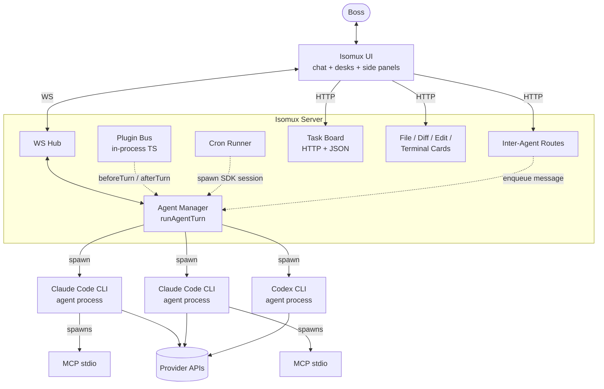
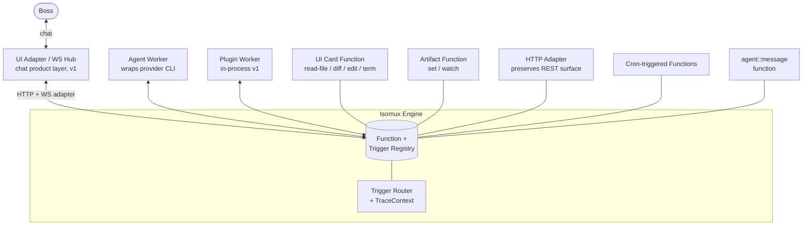

# Unified Worker Model — Migration Design

> Status: exploratory migration design, not an accepted implementation plan. This doc explores what it would mean to apply the "harness is the backend" architectural philosophy (Mike Piccolo / iii, 2026) inside isomux, without adopting iii itself as a runtime dependency. The intent is to make a sharper choice about where the architecture is heading; nothing here is committed to ship.

## Motivation

Isomux today has roughly six de-facto runtime categories. Each one was added for a defensible reason; together they have grown into category sprawl.

| # | Category | Lives as | "Trigger" | "Function" |
|---|---|---|---|---|
| 1 | Agent turn | `agent-manager.ts` + `runAgentTurn` in `plugin-hooks.ts` | boss msg, queued, skill, edit-fork | `session.send` to provider CLI |
| 2 | HTTP routes | manual `pathname` switch in `index.ts` (~7 path families) | HTTP request | hand-written response handler |
| 3 | Task board | HTTP routes + JSON file | POST /tasks | `addTask` / `updateTask` |
| 4 | Cronjob | `cronjob-manager.ts` (separate scheduler) | cron expression | fresh SDK session spawn |
| 5 | Plugin hook | in-process TS module loaded at boot | `beforeTurn` / `afterTurn` | `promptPrefix`, side effects |
| 6 | Inter-agent + card emit | route handlers + 5x `emitAgent*` helpers | HTTP POST | enqueue message / dispatch card event |

Six lifecycles, six observability stories. The `runAgentTurn` central helper is the only thing that knows about more than one of them, and every new capability ends up bolted onto it or onto another lane.

Concrete evidence the sprawl already costs us:

- The "emit a card to chat" pattern is duplicated five times (`emitAgentDiff`, `emitAgentReadFile`, `emitAgentEditRequest`, `emitAgentTerminalCommand`, plus the cronjob path has its own parallel `emitCronjobRunReadFile`). Each emit-card route handler in `index.ts` re-implements its own CORS, body parsing, error shape.
- Recent design conversations (artifact panel, design-experience features) keep running into the question "is this a plugin?" because the v0 plugin contract is narrow (`beforeTurn` / `afterTurn` only) and adding new shapes means either extending the plugin contract or carving out yet another subsystem.
- There is no shared trace across a boss action that crosses lanes (e.g. boss types `/task add foo` → command-handler routes to task-board → notifies an agent → agent sends inter-agent message → receiver acts on it). Correlation today is via timestamps + ad-hoc logging.

### Before / after, at a glance





Every node in the "after" diagram has the same shape: register a function, attach a trigger. The product layer (chat, desks, presence, persistence) is not collapsed; it sits above the engine and uses it.

## The bet

Apply the philosophy *inside* isomux. Do not adopt iii itself as a runtime dependency:

- iii is a young project (its public manifesto was published in 2026) and its protocol/operator model are still evolving.
- Most of what the essay calls out as novel is older than iii: Erlang/OTP processes (1986) had registered functions and live discovery, AWS Lambda + EventBridge (2014) had function-with-triggers, OpenTelemetry covers cross-process tracing. The essay's contribution is *the synthesis and the position* ("agents should not have their own ontology"), not the primitives.
- We can take the position without taking the dependency.

What we adopt:

- Worker / Function / Trigger as the universal internal primitive for the runtime categories above.
- One trace per boss-originated action, propagated across all participants.
- "Add a worker" as the answer to new capability requests, instead of "design a new subsystem."

What we do not adopt:

- Out-of-process wire protocol as a hard requirement. v0 plugins ship in-process; out-of-process workers are a later extension, behind a real second consumer.
- "Browser is a worker" as a core claim. Possibly later for specific surfaces; not in the v1 design.
- The implication that *everything* including auth and persistence collapses into workers. See non-goals.

## Goals

1. Collapse the six runtime categories above into one register-and-trigger primitive.
2. One OpenTelemetry trace per boss-originated turn, propagated through HTTP → registry → agent worker → plugin hook → card emit → WS broadcast.
3. New capability types can be added by registering a function with a trigger, without carving out a new subsystem.
4. Compatibility constraint: zero change to the existing REST surface and existing agent helper endpoints (read-file, diff, edit-file, terminal-command, message) until a later explicit API version. New functionality may ship at new URLs; existing routes become thin adapters that fire the same trigger underneath.

## Non-goals / platform services

The following stay traditional. They may *emit* triggers (e.g. session revoked → trigger) or *attach* trace context (e.g. presence event includes trace id), but they are not workers and should not be modeled as such. There is no runnable unit with lifecycle / retry / error semantics that would benefit from the worker abstraction.

- Authentication and session lifecycle (`auth.ts`, `auth-middleware.ts`, `users.ts`)
- Persistence schema and on-disk file layout (`persistence.ts`, `migrations.ts`)
- Backups (`backup.ts`)
- Presence (`presence.ts`)
- The chat UX itself: desks, topics, log streams, attribution, the boss-as-conversational-counterparty metaphor
- Provider CLI subprocess loops (Claude Code CLI, Codex App-Server). See "What does not collapse" below.

These omissions are deliberate. Collapsing the boss into a worker, or auth into a function registration, would lose the layer that makes isomux a product instead of plumbing. iii is infrastructure; the product layer still has to live somewhere.

## Primitives

Concrete TypeScript shapes. These live in `shared/worker-types.ts` (alongside `shared/plugin-types.ts`) so both the server and any future external worker SDK can re-declare them until the API stabilizes (same pattern the v0 plugin doc adopted).

```ts
export type FunctionId = string; // "ui::card::diff", "agent::message", "tasks::create", ...

export interface TriggerContext {
  /** Trace context propagated through the entire request chain. Generated at
   *  the trigger source (HTTP, cron tick, UI event) and threaded through
   *  every downstream function invocation including agent turns and plugin
   *  hooks. Nested so it can grow toward OTEL's `SpanContext` shape without
   *  reshaping every handler's parameter list. */
  trace: {
    traceId: string;
    spanId: string;
    parentSpanId?: string;
  };
  /** Cancellation signal threaded from the trigger source (HTTP request
   *  abort, cron-driver shutdown, agent-call cancellation, router-initiated
   *  timeout). Long-running handlers must observe it; the router does not
   *  preempt. Mirrors the v0 plugin "Promise.race against timeout" contract,
   *  but exposed as a first-class field instead of an implicit timeout. */
  signal: AbortSignal;
  /** Retry visibility. `attempt` starts at 1 on first invocation; `maxAttempts`
   *  mirrors the function's retry policy (or 1 if no retry). Handlers can
   *  log retry counts, debug idempotency, or short-circuit on the last
   *  attempt without consulting the registry. */
  attempt: number;
  maxAttempts: number;
  /** What invoked this function. */
  invokedBy: TriggerInvocation;
  /** Best-effort attribution. May be unset for system-originated triggers. */
  attribution: {
    userId?: string;
    agentId?: string;
    senderId?: string; // e.g. another agent's id for agent-call triggers
  };
}

export type TriggerInvocation =
  | { kind: "http"; method: string; path: string }
  | { kind: "cron"; schedule: string; firedAt: number }
  /** Plugin hook trigger fired around `agent::turn`, NOT the turn itself.
   *  The turn invocation arrives as one of `http` / `agent-call` / `direct`
   *  depending on what kicked it off. */
  | { kind: "agent-turn-hook"; agentId: string; phase: "before" | "after" }
  | { kind: "ui-subscription"; channel: string }
  | { kind: "agent-call"; receiverAgentId: string }
  | { kind: "direct"; reason: string };

export interface IsomuxFunction {
  id: FunctionId;
  handler: (input: unknown, ctx: TriggerContext) => Promise<unknown>;
  /** Hard cap on handler execution. Trigger router cancels with AbortSignal
   *  and records a timeout to the failure stream. */
  timeoutMs?: number;
  /** If present, the router computes the key and dedupes invocations within
   *  a configurable window (per-trigger-kind default). */
  idempotencyKey?: (input: unknown) => string;
  /** Retry policy. Defaults to no-retry; HTTP triggers should usually opt out;
   *  cron triggers usually opt in. */
  retry?: {
    maxAttempts: number;
    backoffMs: number;
    onlyOn?: (err: unknown) => boolean;
  };
}

export type TriggerBinding =
  | { kind: "http"; method: "GET" | "POST" | "PUT" | "DELETE"; path: string }
  | { kind: "cron"; schedule: string } // 5-field cron expression
  /** Subscribe to plugin hook firings around every `agent::turn`. The
   *  function this binds to is invoked before or after each agent turn,
   *  not as part of the turn's invocation chain. */
  | { kind: "agent-turn-hook"; phase: "before" | "after" }
  | { kind: "ui-subscription"; channel: string }
  | { kind: "agent-call" }; // receiver determined per-invocation

export interface IsomuxWorker {
  id: string;
  transport:
    | { kind: "in-process" }
    | { kind: "websocket"; url: string }; // future
  functions: IsomuxFunction[];
  bindings: Array<{ functionId: FunctionId; trigger: TriggerBinding }>;
}
```

Notes:

- `IsomuxFunction.handler` returns `unknown`. The router does not validate payload shapes in v1; that is each function's responsibility. A schema-validation layer is a possible later add and explicitly out of scope here.
- `TriggerContext.trace` is required, not optional. The router never invokes a function without a trace, even if upstream propagation failed (in which case the router starts a fresh trace and records why). The cost of allocating a trace context per invocation is small; the cost of "is this path allowed to be dark?" debates after a production incident is large.
- Bindings are separated from function definitions so the same function can have multiple triggers (the article's `registerTrigger` example).

## Failure model

Without explicit failure semantics, "trigger" is too hand-wavy to build on. Defaults below; per-function overrides via `IsomuxFunction.retry`.

| Concern | v1 behavior |
|---|---|
| Handler timeout | Per-function `timeoutMs` (default 30s). Router aborts `ctx.signal`. Timeout fires a failure-stream entry; the trigger source decides what to do with the result (HTTP returns 504, cron records a failed run, agent-call surfaces the timeout to the caller). |
| Handler throw | Caught at router boundary. Failure-stream entry. Trigger source maps it: HTTP → 500 with sanitized error, cron → failed run, agent-call → typed error to caller, agent-turn hook → no prefix from that plugin (matches v0 plugin behavior). |
| Retry | None by default. Opt-in via `retry`. Router enforces; handler sees `ctx.attempt` / `ctx.maxAttempts` on every invocation, so retries can be debugged and idempotency cross-checked without consulting the registry. |
| Idempotency | Opt-in via `idempotencyKey`. Router maintains a TTL keyed cache of in-flight + recently-completed keys. Within window, repeat invocations short-circuit with the cached result. Inter-agent messages should derive their key from `(senderAgentId, clientMessageId)` — see open questions. |
| Cancellation | `ctx.signal: AbortSignal` is required on every invocation; long-running handlers must observe it. The router does not preempt. Aborts originate from the trigger source (HTTP request abort, cron driver shutdown, agent-call cancellation) or the router itself (timeout, shutdown). |
| Backpressure / concurrency | Functions are concurrent by default. A global router-level cap (default ~256 in-flight invocations across all functions) prevents a trigger storm from starving agent turns; on cap-hit, new invocations queue with a deadline and the failure stream records cap-induced timeouts separately. Single-flight per-function or per-key is a possible later add behind a config field; not v1. |
| Authorization | Trigger router invokes a policy check before dispatch. HTTP adapter alone is not enough once `agent-call` and `direct` triggers exist: an agent worker calling `tasks::delete` needs the same authorization treatment as an HTTP DELETE would. v1 ships a coarse "who can call which function id" allowlist tied to attribution; finer-grained policy is a later add. Plugin-registered functions go through the same check. |
| Dead-letter | Failed invocations after retry exhaustion land in `~/.isomux/logs/triggers.jsonl` (mirrors `plugins.jsonl`). Structured fields: `functionId`, `traceId`, `spanId`, `invokedBy`, `durationMs`, `attemptCount`, `error`. **Payloads are not logged by default**; opt-in per-function for debugging only. Retention: rotate at 100MB / 30 days (matches the existing `plugins.jsonl` policy). |
| Ordering | Function invocations are **unordered by default**. Inter-agent messages and card emits that have user-visible ordering expectations must be modeled by their function (e.g. a per-receiver in-order queue inside `agent::message`, which already exists today). The trigger router does not provide an ordered-by-key delivery guarantee in v1. |

## Ownership and registration

- Bundled functions register at server boot, **after** persistence init's "ready" milestone, because their config (enable list, allowlist, per-function overrides) lives in persisted state. They live in `server/functions/*.ts` (mirrors the existing `server/plugins/` directory convention but for first-party functions).
- In-process plugins (today's `office-config.json` `enabledPlugins` list) gain a second registration path beyond `beforeTurn`/`afterTurn`: they may also export `functions: IsomuxFunction[]` and `bindings: TriggerBinding[]`. The v0 hook contract becomes a special case ("a plugin that registers two agent-turn-triggered functions"). Existing plugins that only export hooks continue to work unchanged.
- Out-of-process workers (future, P5+) connect via WebSocket with a registration handshake. Out of scope for v1 design; mentioned only to ensure the in-process registration shape is compatible.
- Registry location: in-memory `Map<FunctionId, IsomuxFunction>` + `Map<TriggerKey, FunctionId[]>`, populated at boot. The authoritative list of *which workers are enabled* lives in `office-config.json`; the registry contents are derived from loading those workers.
- Startup ordering: registry init (empty maps, no persisted state needed) → persistence init → bundled function load → plugin worker load → trigger router boot → agent spawn restore. The registry primitive can come up early; what cannot come up early is *populating* it, because that requires persisted enable lists and policy config. The agent restore path can fire triggers (e.g. `agent-turn` hooks), so the router must be live before agents come back.
- Duplicate function ids are a boot-time error (mirrors v0 plugin duplicate-id handling).

## Observability acceptance criteria

The success criterion for the trace propagation phase (P3 below) is concrete:

A single OpenTelemetry trace must span the following chain for a boss-originated action:

1. Boss UI action (e.g. "regenerate artifact") → HTTP request with `traceparent` header.
2. HTTP adapter creates trace, fires `http` trigger.
3. Trigger router invokes target function (e.g. `artifact::regenerate`).
4. Function calls into agent worker (e.g. `agent::message` agent-call trigger).
5. Agent worker invokes `runAgentTurn`, which threads the trace into the `TriggerContext` passed to every plugin `beforeTurn` and `afterTurn` invocation.
6. Plugin tool calls and the eventual `ui::card::artifact` emit (or whichever per-kind card function fired) are spans under the same trace.
7. WS broadcast to subscribed UI clients includes the trace id in event metadata so the UI can correlate render with backend work.

Provider CLI subprocess (Claude Code, Codex) is a span boundary. We observe `session.send` and the resulting event stream; we do not instrument inside the CLI's loop because we do not own it. This is a known fidelity cap and the design accepts it.

The trace backend is OpenTelemetry-compatible (Jaeger, Honeycomb, Datadog, etc.). v1 emits spans using the SDK's env-based configuration (`OTEL_EXPORTER_OTLP_ENDPOINT` and related env vars); no bundled collector or backend ships with isomux.

## What collapses

The runtime categories from the motivation table map into the new model as follows:

| Old category | New shape |
|---|---|
| Agent turn | An `agent::turn` function on each agent worker, invoked by boss message, queued work, skill expansion, edit-fork resend, or an external `agent-call` trigger. Plugin hooks become separate `plugin::beforeTurn` and `plugin::afterTurn` functions that the router fires via `agent-turn-hook` triggers around `agent::turn` (not phases of `agent::turn` itself). |
| HTTP routes | HTTP adapter consumes route registrations and fires `http` triggers. The `index.ts` `pathname` switch shrinks as route families migrate; complete dissolution is an end-state, not a near-phase deliverable. |
| Task board | `tasks::create`, `tasks::update`, `tasks::list`, etc. functions with `http` triggers. Persistence remains the JSON file (platform service). |
| Cronjob | A `cron` trigger driver fires cron-bound functions. The current cronjob scheduler shrinks to the trigger driver; the per-job state lives on the function side. |
| Plugin hook | Plugins register as workers exporting one or more functions. The v0 hook contract becomes a special case: a plugin that registers two `agent-turn-hook`-triggered functions. |
| Inter-agent message | `agent::message` function on each agent worker, invoked via `agent-call` trigger. Replaces the bespoke `POST /agents/:id/message` route handler. |
| Card emit | **One function per card kind** — `ui::card::diff`, `ui::card::read-file`, `ui::card::edit-file`, `ui::card::terminal-command`, `ui::card::artifact`. Each with an `http` trigger that mirrors today's URLs (compatibility). Internally they share a `cardBroadcast(...)` helper for persistence and WS dispatch, but the helper is not the boundary exposed to workers. Per-card functions make permissioning, audit, and per-card-kind evolution clean; a single discriminated `ui::card::set` would collapse them prematurely. |
| MCP tools | MCP bridge worker that exposes MCP tool calls as functions. Deprioritized — see phasing. |

## What does NOT collapse

- **Chat UX.** Chat messages carry persistence semantics (the LogEntry stream), attribution semantics (who said it, which device), UI subscription semantics, and conversational continuity. Reducing them to `trigger()` calls loses the experiential layer. The UI adapter subscribes to the relevant triggers, but the chat metaphor is the product, not the plumbing.
- **The boss is not a worker.** The UI adapter mediates between boss intent and the trigger system. The boss types in chat; the adapter translates to triggers. The reverse direction (system notification → chat card) flows through the same UI adapter. Whether the UI adapter is a server-side dispatch table (v1) or a true browser-side worker (future possibility) is an open question, but the boss-is-a-human-not-a-worker invariant holds either way.
- **Provider CLI subprocess.** We are explicitly *not* trying to make Claude Code CLI or Codex CLI become isomux workers internally. Their internal loops (slash commands, skills, plugin loading, settings.json, session state) are owned by their respective vendors. The agent worker wraps the CLI as an opaque process; trace spans stop at `session.send` and resume on observable CLI events / log emissions. Attempting to instrument inside the CLI would either fork the vendor or wrap with brittle adapters; both are bad bets.

## Migration phases

Tracer-bullet style. Each phase ships a thing the boss can use, validated by feature value rather than plumbing churn.

### P1a: artifact panel ships, primitive allowed to be ugly

Goal: ship a user-visible feature through the new primitive. Do not chase a clean primitive yet; the first consumer is allowed to expose rough edges.

Scope:

- Define `IsomuxFunction`, `TriggerBinding`, `IsomuxWorker`, `TriggerContext` in `shared/worker-types.ts`. Minimum fields needed for artifact set/watch only; the failure-model fields (`signal`, `attempt`, etc.) may be present-but-trivial in P1a if exercising them adds no value yet.
- Implement a minimum in-process `Registry` + `TriggerRouter` in `server/runtime/`. Only the trigger kinds needed for artifact ship: `http` and `ui-subscription`.
- `TriggerContext.trace` is a generated `{ traceId, spanId }` per invocation. No exporter, no real propagation; the field is reserved so P3 does not require a context-shape change.
- Ship the artifact panel (currently a design discussion, see chat transcripts referencing "Claude design experience inside isomux") as:
  - `artifact::set` function, `http` trigger at `POST /agents/:id/artifact`.
  - `artifact::watch` function, `ui-subscription` trigger.
  - UI panel component that renders a sandboxed iframe of the current artifact.

Acceptance: an agent POSTs an artifact, the panel renders it, the boss sees an updated version each iteration. No other subsystem touched. The primitive may be ugly.

Risk: medium. Most risk concentrated in primitives design churn discovered through the first consumer.

### P1b: harden the primitive based on what P1a taught us

Goal: turn the rough primitive from P1a into something a second consumer could safely register against.

Scope:

- Duplicate function id handling: boot-time error, with realpath logged.
- Idempotency cache (TTL'd) with the `idempotencyKey` opt-in.
- Timeout policy enforcement via the central abort path (`ctx.signal` becomes real, not just present).
- Failure stream wiring (`triggers.jsonl`) with the structured fields listed in the failure model.
- Authorization policy check at dispatch — coarse allowlist sufficient for v1.
- Backpressure cap (default ~256 concurrent invocations) with deadline queueing.

Acceptance: the primitive's failure model (above) actually works end-to-end. The P1a artifact functions continue to work unchanged; the hardening is additive infrastructure they happen to benefit from.

Risk: low-medium. Failure mode is bug latency; the new policies fire on edge cases that may not surface until a second consumer.

### P2: route adapter for the new function family

Goal: prove the HTTP trigger model is operationally viable on a narrow surface.

Scope:

- Replace the artifact-panel route handler in `index.ts` with a thin HTTP adapter that consumes route registrations from the registry and fires `http` triggers.
- All other existing routes remain unchanged.
- The adapter sits in front of the manual pathname switch; unmatched paths fall through to the existing handler.

Acceptance: artifact panel routes flow through registry; existing routes flow through legacy. Zero behavior change for legacy paths.

Risk: low. Narrow surface, adapter pattern.

### P3: trace propagation through agent turn

Goal: meet the observability acceptance criteria above.

Scope:

- Adopt OpenTelemetry SDK in the server. v1 emits spans using the SDK's env-based configuration (`OTEL_EXPORTER_OTLP_ENDPOINT` and friends). No bundled collector or backend; the operator wires their own (Jaeger, Honeycomb, Datadog, etc.) at deploy time.
- Thread `TraceContext` through `runAgentTurn` (currently threads `PluginTurnContext`; add trace fields).
- Plugin hooks receive trace id in their context. v0 plugin contract widens; backwards-compatible (new fields, no removals).
- Card emit functions and inter-agent message functions propagate trace.
- WS broadcast includes trace id for UI correlation.

Acceptance: one trace spans boss UI action → HTTP trigger → agent turn → plugin hook → card emit → WS event. Visible end-to-end in a Jaeger-class viewer.

Risk: medium-high. OTEL adoption touches every async boundary. Failure mode is half-instrumented traces that look correct but drop spans at the seams.

### P4: plugin registration through unified primitive

Goal: collapse the v0 plugin contract into the worker model without breaking existing plugins.

Scope:

- Plugins may export `functions` and `bindings` in addition to (or instead of) `beforeTurn` / `afterTurn`.
- v0 plugins are loaded as workers that register two `agent-turn`-triggered functions internally. Their existing exports continue to work via an adapter in the loader.
- mem0 plugin needs no code changes for this phase.

Acceptance: v0 plugin tests pass unchanged; a new plugin can register an arbitrary function (e.g. a redaction-as-tool function via `agent-call` trigger) without v0 hook semantics.

Risk: low-medium. Plugins are small and bounded; the contract widening is the bulk of the work.

### P5+ later collapses

Order to be decided based on what's actually painful by P4 ship:

- Cronjobs → cron-triggered functions. The current scheduler shrinks to a trigger driver.
- Inter-agent messages → `agent-call` triggers. The bespoke `POST /agents/:id/message` route becomes a thin adapter.
- Remaining card-emit endpoints (`read-file`, `diff`, `edit-file`, `terminal-command`) → per-kind `ui::card::*` functions (consistent with P1a's `ui::card::artifact` decision). The five-way duplication dissolves into a shared internal `cardBroadcast(...)` helper that is not the boundary exposed to workers.
- Out-of-process workers via WebSocket protocol. First consumer would be mem0 if it ever needed to leave the Bun process (today it does not).
- MCP bridge worker. Conceptually neat but probably not worth doing early; per-agent MCP access is already handled by Claude Code CLI internals. Revisit if we need MCP tool exposure to non-CLI agents.

## Compatibility constraint

Zero change to the existing REST surface and existing agent helper endpoints until a later explicit API version:

- `POST /agents/:id/diff`, `/read-file`, `/edit-file`, `/terminal-command`, `/message` keep their URLs and bodies.
- `GET|POST /tasks`, `/cronjobs`, `/backup/status` keep their URLs and bodies.
- The WebSocket protocol keeps its event shapes; trace id is an additive field on events that previously did not carry it.
- New functionality may ship at new URLs (e.g. `POST /agents/:id/artifact`); old routes get a thin HTTP adapter that fires the same trigger underneath.

This constraint exists because the agent helper endpoints are documented in agent system prompts and used by external tooling. Breaking them mid-migration would create a long tail of "agent X is on the old API" debugging.

## Open questions

1. **Boss attribution into trace context.** Today: WebSocket session is the source of truth for `attribution.userId`. After: does the UI adapter stamp it, or does the HTTP adapter? Same question for `agentId` on agent-call triggers.
2. **Cron trigger driver vs existing cronjob scheduler.** Share scheduling code, or new driver that supersedes? The existing scheduler has cron-specific niceties (skipped-run records, run history) that the function-with-trigger model needs to preserve.
3. **Out-of-process worker security.** Before we ship any external worker, we need a decision on WebSocket origin checks, auth handshake, surface area. Deferred to whenever P5+ actually picks this up.
4. **Where does the boss fit in the engine diagram?** UI adapter mediates in v1 (server-side dispatch table). If we ever push UI to be a true browser-side worker (per the iii browser SDK pattern), this becomes a real architectural question rather than a naming one.
5. **Provider CLI span boundary fidelity.** We accept the cap; can we improve it without forking the CLI? Possible avenues: parse `--debug` log output, intercept stdio, instrument the SDK below the CLI. Out of scope for v1; flag for later.
6. **Authorization policy storage.** v1 ships a coarse allowlist tied to attribution. Where does the allowlist live (per-function default in source, with overrides in `office-config.json`?), and how does it interact with the per-user-isolation design's "manager" role?

## Acknowledged tradeoffs during migration

- **Two ontologies in flight.** P1 through P5+ runs the new registry alongside the legacy subsystems. Some lanes will migrate later than others, and there is a long middle where "is this a registered function or a legacy handler?" is a coin flip for someone reading the code. Mitigation: name the legacy paths consistently (`legacy*` prefix), keep a single source-of-truth list in this doc updated per phase.
- **Risk of feature drift.** Big refactors during active product evolution risk landing features in the old shape because the new shape is not ready yet. Mitigation: do P1 with a feature that is already wanted (artifact panel), not a feature carved out for the refactor.
- **v0 plugin contract becomes the in-process worker case.** Existing plugins (mem0) need a small adapter at P4. This is a contract widening, not a break, but it does mean the v0 plugin doc gets a follow-up section.
- **Provider CLI opacity caps trace fidelity.** Documented above. Real cost; not avoidable without owning the harness.
- **OpenTelemetry adoption is a real dependency.** Adds runtime overhead, exporter configuration, and an ongoing maintenance surface. The acceptance criteria in P3 are what justifies it; if the trace fidelity is not actually used (boss never opens Jaeger), the cost is uncompensated.

## Risk-based sizing

LOC estimates are deliberately omitted in favor of risk classification, because phase risks are more useful than line counts. Order-of-magnitude only:

| Phase | Risk | Notes |
|---|---|---|
| P1a | Medium | First consumer + minimum primitive. Risk: primitives design churn discovered through the artifact panel. |
| P1b | Low-medium | Hardening additive to a working feature; failure mode is bug latency. |
| P2 | Low | Adapter pattern, narrow surface. |
| P3 | Medium-high | OTEL adoption is wide; half-instrumented traces are the failure mode. |
| P4 | Low-medium | Plugin contract widening; backwards-compatible. |
| P5+ | Varies | Cron and inter-agent each have their own quirks; sizing per slice. |

## Relation to other docs

- **`isomux-plugin-system.md`** — the v0 plugin contract. Preserved as the in-process worker case. P4 widens it; v0 hooks continue to work.
- **`per-agent-mcp-access.md`** — MCP bridge worker is a P5+ topic; this doc does not mandate any change to per-agent MCP access in earlier phases.
- **`plugin-management-design.md`** — orthogonal. That doc covers UI for managing upstream Claude Code's plugin ecosystem; this doc covers isomux's internal worker model.
- **`per-user-isolation-design.md`** — orthogonal. Isolation lives in the platform service layer (auth, persistence) which is explicitly out of scope here.

## Acknowledgments

The framing in this doc is a response to Mike Piccolo's essay "The Harness Is the Backend" (2026), which makes the case for treating agents as first-class participants in a worker / function / trigger system rather than as a separate harness layer above the backend. iii is the runtime that essay describes; this doc takes the position without taking the dependency. The architectural primitives themselves (worker, function, trigger, registry) predate the essay by decades (Erlang/OTP, AWS Lambda + EventBridge, OpenTelemetry); the contribution we adopt is the synthesis applied to LLM agents.
